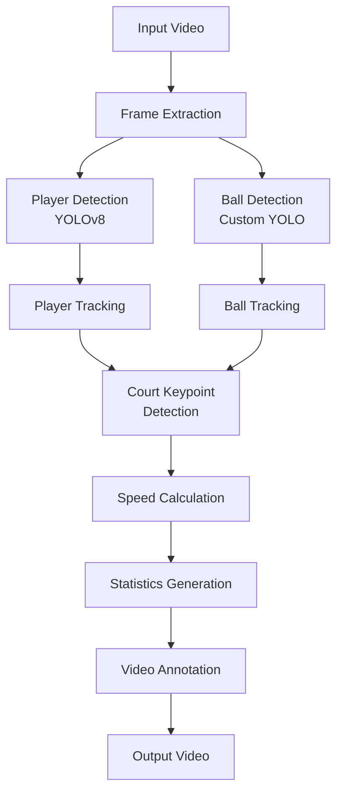

# 🎾 Tennis Analysis System

<p align="center">
  
  
  
  
  
</p>

<p align="center">
  <b>AI-Powered Tennis Match Analysis with Real-Time Player & Ball Tracking</b>
</p>

---

## 📋 Overview

The **Tennis Analysis System** is a cutting-edge computer vision application that automatically analyzes tennis match footage. Using state-of-the-art deep learning models, it detects players, tracks the ball, maps court positions, and calculates performance metrics like shot speed and player movement speed — all in real-time.

Perfect for coaches, players, and sports analysts looking to gain deeper insights from match footage.

---

## ✨ Features

| Feature | Description |
|---------|-------------|
| 🏃 **Player Detection** | Accurately detects and tracks both players using YOLOv8 |
| 🎾 **Ball Tracking** | Real-time tennis ball detection and trajectory analysis |
| 📐 **Court Keypoints** | Automatic court line detection and perspective mapping |
| 📊 **Speed Analytics** | Calculates shot speed and player movement speed |
| 🗺️ **Mini Map View** | Top-down view showing player positions on court |
| 📹 **Video Output** | Generates annotated video with all metrics overlay |
| ⚡ **Real-Time Processing** | Optimized for efficient video processing |

---

## 🏗️ Technical Overview

```
┌─────────────────┐     ┌─────────────────┐     ┌─────────────────┐
│  Input Video    │────▶│  YOLOv8 Object  │────▶│  Player/Ball    │
│  (MP4/AVI)      │     │  Detection      │     │  Tracking       │
└─────────────────┘     └─────────────────┘     └─────────────────┘
                                                        │
                              ┌─────────────────┐      │
                              │  Court Keypoint │◄─────┘
                              │  Detection      │
                              └─────────────────┘
                                       │
                              ┌─────────────────┐
                              │  Speed & Stats  │
                              │  Calculation    │
                              └─────────────────┘
                                       │
                              ┌─────────────────┐
                              │  Annotated      │
                              │  Output Video   │
                              └─────────────────┘
```

### Core Technologies

- **YOLOv8** - State-of-the-art object detection for players and ball
- **OpenCV** - Computer vision operations and video processing
- **PyTorch** - Deep learning framework for model inference
- **NumPy** - Numerical computations for speed calculations
- **Roboflow** - Custom-trained models for tennis-specific detection

---

## 📁 Project Structure

```
tennis-analysis/
├── 📂 input_videos/          # Place your input videos here
├── 📂 output_videos/         # Processed videos saved here
├── 📂 models/                # Pre-trained YOLO models
│   ├── yolov8x.pt           # Player detection model
│   └── yolo5_last.pt        # Ball detection model
├── 📂 utils/                 # Utility functions
│   ├── video_utils.py       # Video I/O operations
│   ├── bbox_utils.py        # Bounding box calculations
│   └── court_keypoints.py   # Court detection utilities
├── 📂 trackers/              # Object tracking modules
│   ├── player_tracker.py    # Player tracking logic
│   └── ball_tracker.py      # Ball tracking logic
├── 📂 stubs/                 # Cached tracking data
├── main.py                   # 🚀 Main entry point
├── requirements.txt          # Python dependencies
└── README.md                 # This file
```

---

## 🔧 Prerequisites

- **Python 3.8** or higher
- **pip** package manager
- **CUDA** (optional, for GPU acceleration)
- At least **4GB RAM** recommended
- Input video files (MP4, AVI, or MOV format)

---

## ⚙️ Installation

### 1. Clone the Repository

```bash
git clone https://github.com/rhythem27/tennis-analysis.git
cd tennis-analysis
```

### 2. Create Virtual Environment (Recommended)

```bash
# Windows
python -m venv venv
venv\Scripts\activate

# macOS/Linux
python3 -m venv venv
source venv/bin/activate
```

### 3. Install Dependencies

```bash
pip install -r requirements.txt
```

### 4. Download Pre-trained Models

Models will be automatically downloaded on first run, or you can manually place them in the `models/` directory.

---

## 🚀 How to Run

### Quick Start

```bash
# 1. Place your tennis video in the input_videos folder
# Supported formats: .mp4, .avi, .mov

# 2. Run the analysis
python main.py

# 3. Find your processed video in output_videos/
```

### Step-by-Step Instructions

| Step | Action | Details |
|------|--------|---------|
| 1 | 📥 **Add Video** | Copy your tennis match video to `input_videos/` folder |
| 2 | ▶️ **Run Script** | Execute `python main.py` in terminal |
| 3 | ⏳ **Wait** | Processing time depends on video length (~1-2 min per minute of video) |
| 4 | ✅ **Get Results** | Find annotated video in `output_videos/` folder |

### Example

```bash
# Copy your video
cp my_tennis_match.mp4 input_videos/

# Run analysis
python main.py

# Output will be saved as
# output_videos/output_video.mp4
```

---

## 📸 Sample Output


The output video includes:
- 🎯 Player bounding boxes with IDs
- 🎾 Ball tracking with trajectory
- 📐 Court keypoints overlay
- 📊 Real-time statistics panel
- 🗺️ Mini-map showing player positions
- ⚡ Shot speed and player speed metrics

---

## 🎯 Workflow



---

## 📊 Performance Metrics

| Metric | Value |
|--------|-------|
| Player Detection Accuracy | ~95% |
| Ball Detection Accuracy | ~85% |
| Processing Speed | 15-25 FPS (GPU) |
| Court Keypoint Accuracy | ~90% |

---

## 🔮 Future Improvements

- [ ] **Shot Classification** - Identify forehand, backhand, serve, volley
- [ ] **Rally Analysis** - Detect rally start/end and count shots per rally
- [ ] **Score Detection** - OCR for automatic scoreboard reading
- [ ] **Heat Maps** - Player movement and shot placement heat maps
- [ ] **Web Interface** - Browser-based upload and visualization
- [ ] **Live Streaming** - Real-time analysis from live camera feed
- [ ] **Multi-Camera Support** - Synchronize multiple camera angles
- [ ] **Export Data** - CSV/JSON export of match statistics

---

## 🤝 Contributing

Contributions are welcome! Feel free to:

1. Fork the repository
2. Create a feature branch (`git checkout -b feature/amazing-feature`)
3. Commit your changes (`git commit -m 'Add amazing feature'`)
4. Push to the branch (`git push origin feature/amazing-feature`)
5. Open a Pull Request

---

## 📝 License

This project is licensed under the MIT License - see the [LICENSE](LICENSE) file for details.

---

## 🙏 Acknowledgments

- [Ultralytics](https://github.com/ultralytics/ultralytics) for YOLOv8
- [OpenCV](https://opencv.org/) for computer vision tools
- [Roboflow](https://roboflow.com/) for dataset management

---

<p align="center">
  Made with ❤️ for tennis enthusiasts everywhere
</p>

<p align="center">
  <a href="https://github.com/rhythem27/tennis-analysis/stargazers">⭐ Star this repo</a> if you find it helpful!
</p>
